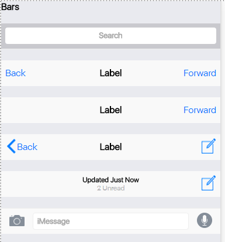
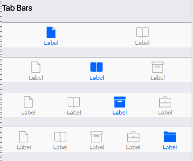
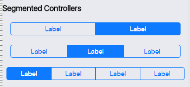
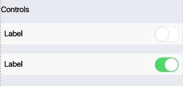

# IOS9 CSS Components
Using CSS and JavaScript to simulate the layout style of IOS 9.   
用CSS和JavaScript模拟IOS 9的应用界面风格。  

#### Components / 组建包括  
* Bars      |   标题栏
* Controls  |   控制按钮
* Buttons   |   按钮组
* Tooltips  |   提示工具   
  Wait for more...  
  待定..
  
#### Screen Capture / 截屏  
&nbsp;

&nbsp;  
